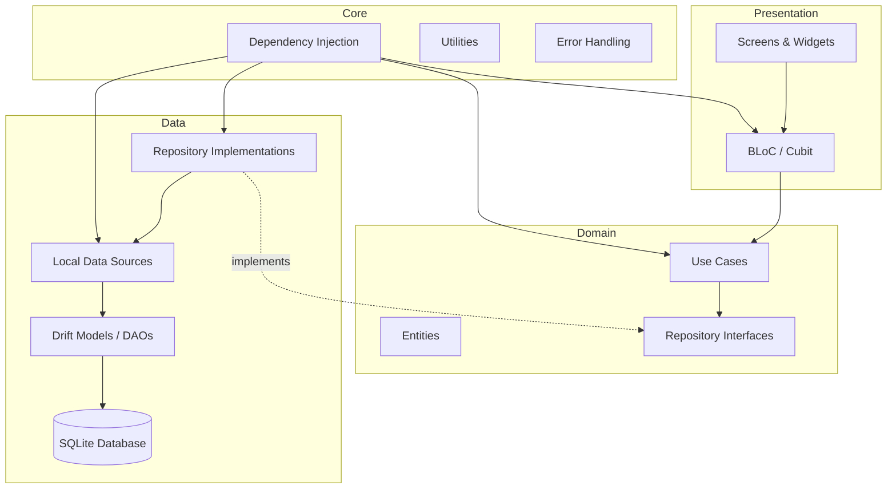
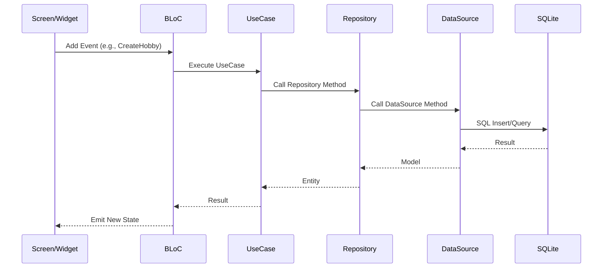
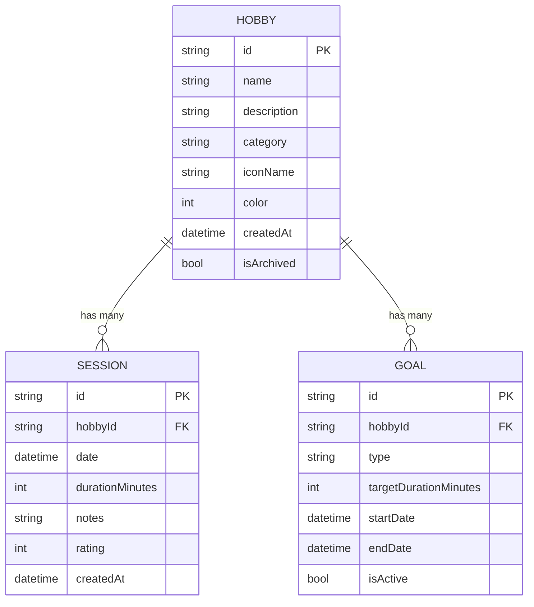

# Design Document: Flutter Hobby Tracker

## Overview

The Flutter Hobby Tracker is a mobile application built with Flutter using Clean Architecture and the BLoC state management pattern. The app enables users to manage hobbies, log sessions, track time with a built-in timer, set goals, and visualize progress through charts. All data is persisted locally using SQLite via the Drift ORM.

The architecture separates concerns into four layers:
- **Domain**: Entities, repository interfaces, and use cases (business logic)
- **Data**: Drift database, models, data sources, and repository implementations
- **Presentation**: BLoC state management, screens, and widgets
- **Core**: Shared utilities, constants, dependency injection, and error handling

## Architecture



### State Management Flow



## Components and Interfaces

### Domain Layer

#### Entities

```dart
class Hobby {
  final String id;
  final String name;
  final String? description;
  final String category;
  final String iconName;
  final int color;
  final DateTime createdAt;
  final bool isArchived;
}

class Session {
  final String id;
  final String hobbyId;
  final DateTime date;
  final int durationMinutes;
  final String? notes;
  final int? rating; // 1-5
  final DateTime createdAt;
}

class Goal {
  final String id;
  final String hobbyId;
  final GoalType type; // weekly, monthly
  final int targetDurationMinutes;
  final DateTime startDate;
  final DateTime endDate;
  final bool isActive;
}

enum GoalType { weekly, monthly }
```

#### Repository Interfaces

```dart
abstract class HobbyRepository {
  Future<List<Hobby>> getActiveHobbies();
  Future<Hobby?> getHobbyById(String id);
  Future<void> createHobby(Hobby hobby);
  Future<void> updateHobby(Hobby hobby);
  Future<void> archiveHobby(String id);
}

abstract class SessionRepository {
  Future<List<Session>> getSessionsByHobby(String hobbyId);
  Future<List<Session>> getSessionsInRange(DateTime start, DateTime end);
  Future<List<Session>> getRecentSessions(int limit);
  Future<int> getTotalDurationForHobbyInRange(String hobbyId, DateTime start, DateTime end);
  Future<void> createSession(Session session);
}

abstract class GoalRepository {
  Future<List<Goal>> getActiveGoals();
  Future<List<Goal>> getGoalsByHobby(String hobbyId);
  Future<void> createGoal(Goal goal);
  Future<void> deactivateGoal(String id);
}
```

#### Use Cases

Each use case encapsulates a single business operation:

- `CreateHobbyUseCase` — validates and creates a hobby
- `UpdateHobbyUseCase` — validates and updates a hobby
- `ArchiveHobbyUseCase` — archives (soft-deletes) a hobby
- `GetActiveHobbiesUseCase` — retrieves non-archived hobbies
- `LogSessionUseCase` — validates and creates a session
- `GetSessionsByHobbyUseCase` — retrieves sessions for a hobby
- `GetRecentSessionsUseCase` — retrieves N most recent sessions
- `CreateGoalUseCase` — validates and creates a goal
- `GetActiveGoalsUseCase` — retrieves active goals with progress
- `DeactivateGoalUseCase` — deactivates a goal
- `GetStatsUseCase` — aggregates session data for charts

### Data Layer

#### Drift Database Schema

```dart
class HobbyTable extends Table {
  TextColumn get id => text()();
  TextColumn get name => text().withLength(min: 1)();
  TextColumn get description => text().nullable()();
  TextColumn get category => text()();
  TextColumn get iconName => text()();
  IntColumn get color => integer()();
  DateTimeColumn get createdAt => dateTime()();
  BoolColumn get isArchived => boolean().withDefault(const Constant(false))();

  @override
  Set<Column> get primaryKey => {id};
}

class SessionTable extends Table {
  TextColumn get id => text()();
  TextColumn get hobbyId => text().references(HobbyTable, #id)();
  DateTimeColumn get date => dateTime()();
  IntColumn get durationMinutes => integer()();
  TextColumn get notes => text().nullable()();
  IntColumn get rating => integer().nullable()();
  DateTimeColumn get createdAt => dateTime()();

  @override
  Set<Column> get primaryKey => {id};
}

class GoalTable extends Table {
  TextColumn get id => text()();
  TextColumn get hobbyId => text().references(HobbyTable, #id)();
  TextColumn get type => text()(); // 'weekly' or 'monthly'
  IntColumn get targetDurationMinutes => integer()();
  DateTimeColumn get startDate => dateTime()();
  DateTimeColumn get endDate => dateTime()();
  BoolColumn get isActive => boolean().withDefault(const Constant(true))();

  @override
  Set<Column> get primaryKey => {id};
}
```

#### Data Sources

```dart
abstract class HobbyLocalDataSource {
  Future<List<HobbyTableData>> getActiveHobbies();
  Future<HobbyTableData?> getHobbyById(String id);
  Future<void> insertHobby(HobbyTableCompanion hobby);
  Future<void> updateHobby(HobbyTableCompanion hobby);
  Future<void> archiveHobby(String id);
}

abstract class SessionLocalDataSource {
  Future<List<SessionTableData>> getSessionsByHobby(String hobbyId);
  Future<List<SessionTableData>> getSessionsInRange(DateTime start, DateTime end);
  Future<List<SessionTableData>> getRecentSessions(int limit);
  Future<int> getTotalDurationForHobbyInRange(String hobbyId, DateTime start, DateTime end);
  Future<void> insertSession(SessionTableCompanion session);
}

abstract class GoalLocalDataSource {
  Future<List<GoalTableData>> getActiveGoals();
  Future<List<GoalTableData>> getGoalsByHobby(String hobbyId);
  Future<void> insertGoal(GoalTableCompanion goal);
  Future<void> deactivateGoal(String id);
}
```

### Presentation Layer

#### BLoCs

| BLoC | Events | States |
|------|--------|--------|
| `HobbyListBloc` | LoadHobbies, CreateHobby, ArchiveHobby | Loading, Loaded(hobbies), Error |
| `HobbyDetailBloc` | LoadHobbyDetail | Loading, Loaded(hobby, sessions), Error |
| `SessionBloc` | LogSession | Initial, Saving, Saved, Error |
| `TimerCubit` | start, pause, resume, stop, discard | Initial, Running(elapsed), Paused(elapsed), Stopped(elapsed) |
| `DashboardBloc` | LoadDashboard | Loading, Loaded(stats, recentSessions), Empty, Error |
| `GoalBloc` | LoadGoals, CreateGoal, DeactivateGoal | Loading, Loaded(goals), Error |
| `StatsBloc` | LoadStats, ChangeTimePeriod | Loading, Loaded(chartData), Empty, Error |

#### Screen Routing (go_router)

| Route | Screen | Description |
|-------|--------|-------------|
| `/` | DashboardScreen | Main dashboard |
| `/hobbies` | HobbiesListScreen | List of active hobbies |
| `/hobbies/:id` | HobbyDetailScreen | Hobby detail with sessions |
| `/hobbies/add` | AddEditHobbyScreen | Create new hobby |
| `/hobbies/:id/edit` | AddEditHobbyScreen | Edit existing hobby |
| `/hobbies/:id/log` | LogSessionScreen | Log a session for a hobby |
| `/timer` | TimerScreen | Built-in stopwatch |
| `/goals` | GoalsScreen | Active goals with progress |
| `/goals/add` | AddGoalScreen | Create new goal |
| `/stats` | StatsScreen | Charts and visualizations |

## Data Models

### Entity Relationships



### Validation Rules

| Field | Rule |
|-------|------|
| Hobby.name | Non-empty, non-whitespace-only string |
| Session.durationMinutes | Positive integer (> 0) |
| Session.rating | Integer between 1 and 5 (inclusive), or null |
| Goal.targetDurationMinutes | Positive integer (> 0) |
| Goal date range | endDate must be after startDate |

### Data Mapping

Domain entities map to/from Drift table data objects via extension methods on the repository implementations. Each repository implementation converts between `*TableData` (Drift) and domain `Entity` objects, keeping the domain layer free of database dependencies.


## Correctness Properties

*A property is a characteristic or behavior that should hold true across all valid executions of a system — essentially, a formal statement about what the system should do. Properties serve as the bridge between human-readable specifications and machine-verifiable correctness guarantees.*

### Property 1: Hobby persistence round-trip

*For any* valid hobby (non-empty name, valid icon, color, and category), creating it and then reading it back from the repository SHALL produce an equivalent hobby object. Similarly, updating any field and reading back SHALL reflect the updated values.

**Validates: Requirements 1.1, 1.3, 1.6**

### Property 2: Whitespace hobby name rejection

*For any* string composed entirely of whitespace characters (including the empty string), attempting to create a hobby with that name SHALL be rejected with a validation error, and the hobbies list SHALL remain unchanged.

**Validates: Requirements 1.2**

### Property 3: Active hobbies list invariant

*For any* set of hobbies (some archived, some not), retrieving the active hobbies list SHALL return only hobbies where isArchived is false, and the list SHALL be sorted by createdAt in ascending order.

**Validates: Requirements 1.4, 1.5**

### Property 4: Session persistence round-trip

*For any* valid session (positive duration, valid hobby reference, optional notes, optional rating in 1-5), creating it and then reading it back from the repository SHALL produce an equivalent session object with all fields preserved, including notes and rating.

**Validates: Requirements 2.1, 2.4, 2.5**

### Property 5: Non-positive session duration rejection

*For any* integer that is zero or negative, attempting to create a session with that duration SHALL be rejected with a validation error, and no session SHALL be added.

**Validates: Requirements 2.2**

### Property 6: Session rating out-of-range rejection

*For any* integer outside the range 1 to 5 (inclusive), attempting to create a session with that rating SHALL be rejected with a validation error.

**Validates: Requirements 2.6**

### Property 7: Sessions sorted by date descending

*For any* hobby with multiple sessions, retrieving sessions for that hobby SHALL return them sorted by date in descending order (most recent first).

**Validates: Requirements 2.3**

### Property 8: Timer pause/resume round-trip

*For any* running timer with some elapsed time, pausing and then resuming SHALL continue counting from the exact elapsed time at the moment of pause. The elapsed time after resume SHALL be greater than or equal to the elapsed time at pause.

**Validates: Requirements 3.2, 3.3**

### Property 9: Timer stop yields correct duration

*For any* running timer, stopping it SHALL produce a duration value equal to the total elapsed time, and that duration SHALL be usable to create a valid session.

**Validates: Requirements 3.4**

### Property 10: Timer discard resets state

*For any* timer state (running, paused, or stopped with any elapsed time), discarding SHALL reset the elapsed time to zero and the timer state to initial, and no session record SHALL be created.

**Validates: Requirements 3.5**

### Property 11: Dashboard active hobby count

*For any* set of hobbies, the dashboard's active hobby count SHALL equal the number of hobbies where isArchived is false.

**Validates: Requirements 4.1**

### Property 12: Dashboard weekly total duration

*For any* set of sessions, the dashboard's weekly total duration SHALL equal the sum of durationMinutes for all sessions whose date falls within the current week (Monday to Sunday).

**Validates: Requirements 4.2**

### Property 13: Dashboard recent sessions limit and order

*For any* set of sessions, the dashboard's recent sessions list SHALL contain at most 5 sessions, and those sessions SHALL be the most recent by date, sorted in descending order.

**Validates: Requirements 4.3**

### Property 14: Goal persistence round-trip

*For any* valid goal (valid hobby, type, positive target duration, valid date range), creating it and then reading it back from the repository SHALL produce an equivalent goal object.

**Validates: Requirements 5.1, 5.6**

### Property 15: Non-positive goal target rejection

*For any* integer that is zero or negative, attempting to create a goal with that target duration SHALL be rejected with a validation error.

**Validates: Requirements 5.2**

### Property 16: Invalid goal date range rejection

*For any* pair of dates where the end date is before the start date, attempting to create a goal with that date range SHALL be rejected with a validation error.

**Validates: Requirements 5.3**

### Property 17: Goal progress percentage calculation

*For any* active goal and set of sessions for that goal's hobby within the goal's date range, the progress percentage SHALL equal (sum of session durations in range / target duration) × 100, clamped to a maximum of 100%.

**Validates: Requirements 5.4**

### Property 18: Goal completion on target met

*For any* active goal, when the accumulated session duration for the goal's hobby within the goal's date range meets or exceeds the target duration, the goal SHALL be marked as completed.

**Validates: Requirements 5.5**

### Property 19: Goal deactivation removes from active list

*For any* active goal, deactivating it SHALL set isActive to false, and the goal SHALL no longer appear in the active goals list.

**Validates: Requirements 5.7**

### Property 20: Stats per-hobby aggregation and proportions

*For any* set of sessions within a selected time period, the stats aggregation SHALL produce per-hobby total durations that equal the sum of session durations grouped by hobbyId, and each hobby's proportion SHALL equal its total duration divided by the grand total across all hobbies. All proportions SHALL sum to 1.0 (within floating-point tolerance).

**Validates: Requirements 6.1, 6.2**

### Property 21: Stats daily aggregation

*For any* set of sessions within a selected time period, the daily aggregation SHALL produce daily totals that equal the sum of session durations grouped by date.

**Validates: Requirements 6.3**

### Property 22: Stats excludes hobbies with no sessions

*For any* set of hobbies and sessions within a selected time period, hobbies with zero sessions in that period SHALL not appear in the chart data output.

**Validates: Requirements 6.5**

### Property 23: Database failure preserves state

*For any* database operation that fails, the application state observable by the user SHALL remain unchanged from before the operation was attempted.

**Validates: Requirements 7.4**

## Error Handling

### Validation Errors

All validation is performed at the use case layer before any database operation:

| Validation | Error | User Feedback |
|-----------|-------|---------------|
| Empty/whitespace hobby name | `ValidationException('Hobby name cannot be empty')` | Inline form error on name field |
| Non-positive session duration | `ValidationException('Duration must be greater than zero')` | Inline form error on duration field |
| Rating outside 1-5 | `ValidationException('Rating must be between 1 and 5')` | Inline form error on rating field |
| Non-positive goal target | `ValidationException('Target duration must be greater than zero')` | Inline form error on target field |
| End date before start date | `ValidationException('End date must be after start date')` | Inline form error on date fields |

### Database Errors

Database errors are caught at the repository layer and converted to domain-level `DatabaseException` objects. BLoCs handle these by emitting an error state with a user-friendly message while preserving the previous data state.

```dart
class Failure {
  final String message;
  const Failure(this.message);
}

class ValidationFailure extends Failure {
  const ValidationFailure(super.message);
}

class DatabaseFailure extends Failure {
  const DatabaseFailure(super.message);
}
```

### BLoC Error State Pattern

Each BLoC follows a consistent error handling pattern:

```dart
// In BLoC event handler
try {
  final result = await useCase.execute(params);
  emit(LoadedState(data: result));
} on ValidationFailure catch (e) {
  emit(ErrorState(message: e.message));
} on DatabaseFailure catch (e) {
  emit(ErrorState(message: 'Something went wrong. Please try again.'));
}
```

## Testing Strategy

### Testing Framework

- **Unit tests**: `flutter_test` (built-in)
- **Property-based tests**: `glados` package (Dart property-based testing library)
- **BLoC tests**: `bloc_test` package
- **Mocking**: `mocktail` package

### Dual Testing Approach

Both unit tests and property-based tests are required for comprehensive coverage:

- **Unit tests** verify specific examples, edge cases, and error conditions
- **Property-based tests** verify universal properties across randomly generated inputs
- Together they provide comprehensive coverage: unit tests catch concrete bugs, property tests verify general correctness

### Property-Based Testing Configuration

- Library: `glados` (Dart PBT library with built-in generators and shrinking)
- Minimum 100 iterations per property test
- Each property test must reference its design document property with a tag comment:
  ```dart
  // Feature: flutter-hobby-tracker, Property 1: Hobby persistence round-trip
  ```

### Test Organization

```
test/
├── domain/
│   └── usecases/
│       ├── create_hobby_test.dart
│       ├── log_session_test.dart
│       ├── create_goal_test.dart
│       └── get_stats_test.dart
├── data/
│   └── repositories/
│       ├── hobby_repository_test.dart
│       ├── session_repository_test.dart
│       └── goal_repository_test.dart
├── presentation/
│   └── blocs/
│       ├── hobby_list_bloc_test.dart
│       ├── timer_cubit_test.dart
│       ├── dashboard_bloc_test.dart
│       ├── goal_bloc_test.dart
│       └── stats_bloc_test.dart
└── properties/
    ├── hobby_properties_test.dart
    ├── session_properties_test.dart
    ├── timer_properties_test.dart
    ├── dashboard_properties_test.dart
    ├── goal_properties_test.dart
    └── stats_properties_test.dart
```

### Unit Test Focus Areas

- Validation logic in use cases (specific invalid inputs, boundary values)
- Data mapping between Drift models and domain entities
- BLoC state transitions for specific scenarios
- Edge cases: empty lists, null optional fields, boundary dates

### Property Test Focus Areas

- Persistence round-trips (Properties 1, 4, 14)
- Input validation across all invalid inputs (Properties 2, 5, 6, 15, 16)
- List invariants — filtering and sorting (Properties 3, 7, 13)
- Timer state machine transitions (Properties 8, 9, 10)
- Aggregation calculations (Properties 11, 12, 17, 20, 21)
- State invariants (Properties 18, 19, 22, 23)
